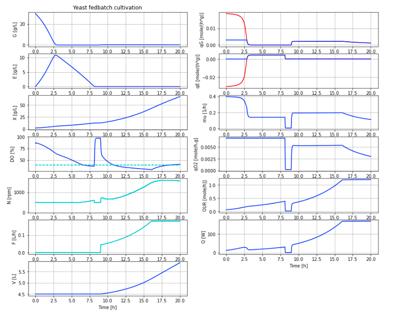

# BPL_YEAST_AIR_Fedbatch

This example of cultivation of yeast culture using fedbatch technique is in laboratory scale.
The model describes by-product (ethanol) formation at over-feeding as well as gas phase of oxygen, carbon dioxide
and even smaller amount of ethanol. Simulation is done using an FMU from Bioprocess Library *for* Modelica. Below a diagram
with a typical simulation that you will get at the end of the Jupyter notebook.

You see in the diagram several typical aspects of yeast fedbatch cultivation (control variables in cyan):
* Initial batch phase where glucose is consumed and ethanol produced until time 2.5 hour. 
* Later consumption of the produced ethanol (liquid phase) until time 8.0 hour. Note that growth rate slow down compared to the intial period. The specific oxygen uptake rate qO2 remains at maximal rate through this seamless switch of metabolism from glucose to ethanol.
* The specific uptake of glucose qG and ethanol qE are shown in separate diagrams. The part of curves that are red show the initially increased glucose uptake that bring overflow metabolism and ethanol production (shown as negative uptake). The respirative uptake part in blue line.
* When all substrate is consumed after 8.0 hours the dissolved oxygen levels goes up quickly and the controller takes down the stirrer speed to a minimum level. Normally the feeding is started when rise in dissolved oxygen is detected but here the feeding is started after one hour for illustration.
* Fedbatch feeding of glucose substrate at time 9.0 hour. Feed rate increase exponentially until 17 hours and then kept constant. The feed profile is chosen to keep glucose at a low level and some margin to overflow metabolism and the specific oxygen uptake rate qO2 remains lower than the maximal capacity that we see during the batch phase.
* During the last few hours from time 17 hours and on, the culture continue to grow but the total oxygen uptake rate OUR remains constant as the substrate feed is. The total heat Q produced by the cultures is also constant during these last few hours.
* During the fedbatch culture the stirrer speed control dissolved oxygen using PID-control. Note that the controller has some difficulty to eliminate the difference between setpoint and measured dissolved oxygen. This is a typical limitation of the I-part to handle the rapid increase of oxygen demand. The control error can be made smaller with a different tuning, but cannot be eliminated using PID-control.

You start up the notebook in Colab by pressing here
[start BPL notebook](https://colab.research.google.com/github/janpeter19/BPL_YEAST_AIR_Fedbatch/blob/main/BPL_YEAST_AIR_Fedbatch_colab.ipynb)
or alternatively (experimentally)
[start BPL notebook with FMPy](https://github.com/janpeter19/BPL_YEAST_AIR_Fedbatch/blob/main/BPL_YEAST_AIR_Fedbatch_fmpy_colab.ipynb).
Then you in the menu choose Runtime/Run all. If you have chosen the altarnative with FMPy click first on the symbol Open in Colab.
The subsequent execution of the simulations of microbial growth take just a second or so. 

You can continue in the notebook and make new simulations and follow the examples given. Here are many things to explore!

See also the related repositories: BPL_TEST2_Fedbatch and BPL_CHO_Fedbatch.

Note that:
* The script occassionaly get stuck during installation. Then just close the notebook and start from scratch.
* Remember, you need to have a google-account!

Just to be clear, no installation is done at your local computer.

License information:
* The binary-file with extension FMU is shared under the permissive MIT-license
* The other files are shared under the GPL 3.0 license

